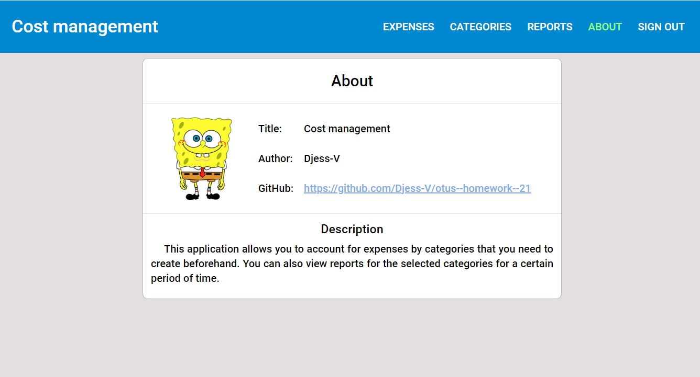
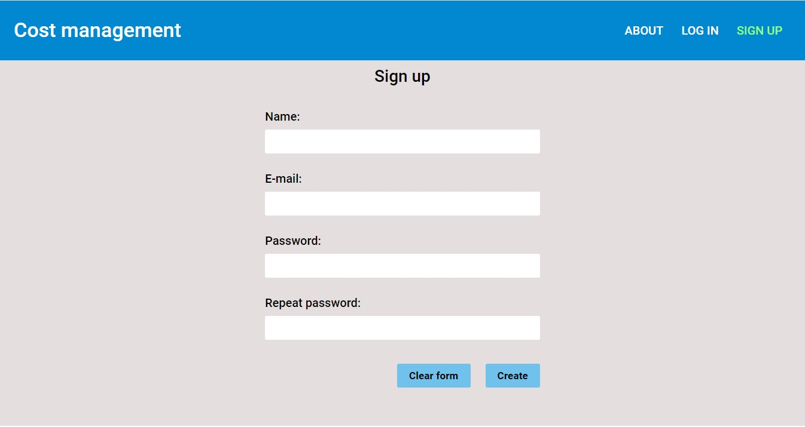
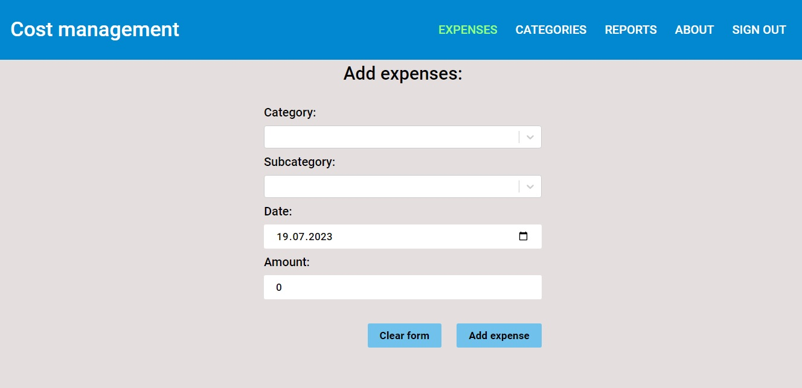
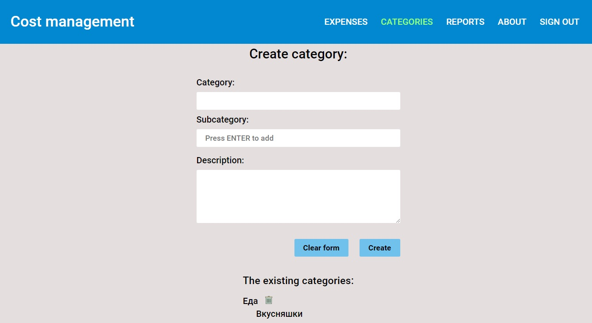
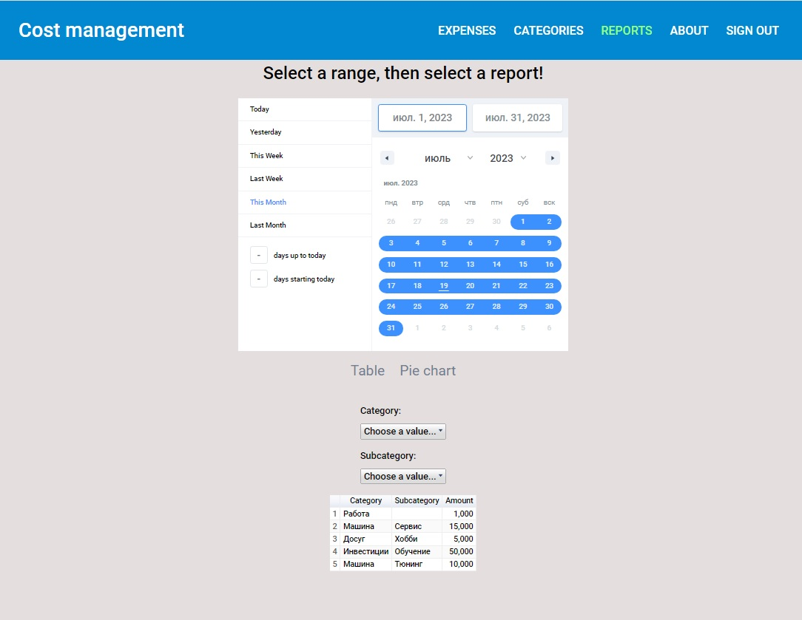

<h1 align="center">Приложение для учёта расходов, с отчётами за выбранный период</h1>

_**[Развёрнуто здесь](https://djess-v.github.io/otus--homework--21/)**_

---

<h2>Визуальное представление</h2>

Страница - "About"

Страница - "Sign In"

Страница - "Expenses"

Страница - "Categories"

Страница - "Report Table"

Страница - "Report PieChart"

<h2>Описание приложения</h2>

Для получения доступа к функционалу приложения Вам необходимо пройти аутентификацию.

Необходимо добавить категории на вкладке CATEGORIES. Одной будет достаточно!

На вкладке EXPENSES вы можете добавить запись, понесённых расходов, выбрав предварительно Категорию (обязательно), Субкатегорию (необязательно), Дату (обязательно) и Сумму (Обязательно).

Перейдя на вкладку REPORTS сначала выберите необходимый период и нажмите ссылку соответствующего отчёта (Table, Pie chart). Отчёт готов!

